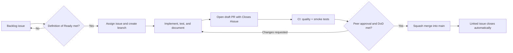

# MLE Final Project: Reinforcement Learning for Bomberman

[](https://github.com/1BlauNitrox/mle-final-project/actions/workflows/ci.yml)

This repository contains our complete code base, experiment records, and technical
documentation for the Machine Learning Essentials final project (summer semester
2026). The goal is to design, train, compare, and scientifically evaluate at least
two machine-learning agents for Bomberman, then submit the strongest agent to the
tournament.

The repository includes the official
[`ukoethe/bomberman_rl`](https://github.com/ukoethe/bomberman_rl) framework.

## Important dates

| Milestone | Deadline |
| --- | --- |
| Optional submission test | 17 September 2026, 21:00 |
| Best agent code | 21 September 2026, 21:00 |
| PDF report | 28 September 2026, 21:00 |

## Core project requirements

- Build and describe at least **two different learned models**.
- At least one model must focus on techniques covered in the lecture.
- Submit the best agent directory, including trained parameters, as
  `final-project-agent-code.zip`.
- Use a systematic scientific process: hypotheses, controlled experiments,
  meaningful metrics, baselines, fixed seeds, and documented conclusions.
- Compare changes against earlier variants and the supplied agents.
- Keep evaluation compatible with one CPU thread, 8 GB RAM, and the 0.5-second
  action deadline.
- Do not use multiprocessing in the final evaluation agent. It is allowed during
  training.
- Keep every final runtime dependency and trained parameter inside the submitted
  agent directory.
- Declare every additional Python library in `requirements.txt` and at the start
  of the report.
- Publish the complete code base, including all developed models, but do not
  publish the report PDF in this repository.
- Mark the responsible author after every report heading.
- Clearly disclose AI assistance and substantially review and refine AI-generated
  drafts in the team's own style.

The complete, source-based checklist is in
[`docs/0001-project-requirements.md`](docs/0001-project-requirements.md).

## Quick start

Python 3.13 is recommended because it has reliable prebuilt wheels for `pygame`
and the scientific Python stack.

### Windows PowerShell

```powershell
git clone https://github.com/1BlauNitrox/mle-final-project.git
cd mle-final-project
py -3.13 -m venv .venv
.\.venv\Scripts\Activate.ps1
python -m pip install -r requirements-dev.txt
```

### macOS or Linux

```bash
git clone https://github.com/1BlauNitrox/mle-final-project.git
cd mle-final-project
python3.13 -m venv .venv
source .venv/bin/activate
python -m pip install -r requirements-dev.txt
```

Watch the supplied rule-based agents:

```bash
python main.py play
```

Run a fast headless smoke test:

```bash
python main.py play --no-gui --n-rounds 1
```

Start training a team agent:

```bash
python main.py play --my-agent <agent_name> --train 1 --no-gui --n-rounds 1000
```

Run all repository checks:

```bash
ruff check tests training scripts agent_code/_team_agent_template
pytest
```

## Repository structure

```text
.
|-- agent_code/
|   |-- _team_agent_template/     # Copy this when starting a learned agent
|   |-- <agent_name>/             # One self-contained directory per model
|   |   |-- callbacks.py          # Evaluation setup and action policy
|   |   |-- train.py              # Framework-required training callbacks
|   |   |-- README.md             # Agent card and experiment summary
|   |   |-- model.py              # Optional model implementation
|   |   |-- features.py           # Optional feature engineering
|   |   `-- model.*               # Trained parameters needed for evaluation
|   `-- rule_based_agent/ ...     # Framework baselines
|-- training/                     # Cross-agent launchers and sweep guidance
|-- experiments/                  # Versioned plans and compact result summaries
|-- tests/                        # Contract and repository tests
|-- docs/                         # Numbered knowledge base and decisions
|-- .github/                      # Issue forms, PR template, and automation
`-- main.py                       # Bomberman entry point
```

### Why training is split this way

Every learned agent gets its own directory. Its `callbacks.py`, `train.py`,
feature code, model implementation, configuration, and trained parameters stay
together. This is required for reliable submission because the tournament copies
only one directory into `agent_code/`.

The root `training/` directory is only for cross-agent orchestration, such as
curriculum commands, hyperparameter sweeps, seed management, or plotting. An
evaluation agent must never import from it. This gives us reusable tooling without
creating a hidden tournament dependency. See
[`docs/0002-repository-architecture.md`](docs/0002-repository-architecture.md).

## Development workflow



1. Select an issue that meets the
   [Definition of Ready](docs/0005-definition-of-ready-and-done.md).
2. Branch from current `main` using
   `<type>/<issue-number>-<short-description>`, for example
   `experiment/12-q-learning-reward-sweep`.
3. Open a draft pull request early and include `Closes #12`.
4. Record the hypothesis, setup, seeds, baselines, metrics, and result for
   experiment changes.
5. Mark the PR ready only after local tests and documentation are complete.
6. Obtain at least one approval from another team member and pass required CI.
7. Squash merge. GitHub closes the linked issue automatically.

Direct pushes to `main` are not part of the workflow. Full details are in
[`CONTRIBUTING.md`](CONTRIBUTING.md) and
[`docs/0003-development-workflow.md`](docs/0003-development-workflow.md).

## Documentation

The `docs/` directory follows the numbered knowledge-base style used by the
reference project. Add a new numbered document whenever the team makes an
important decision or learns something needed to reproduce the work.

| Document | Purpose |
| --- | --- |
| [0001](docs/0001-project-requirements.md) | Assignment requirements and submission checklist |
| [0002](docs/0002-repository-architecture.md) | Agent and training architecture decisions |
| [0003](docs/0003-development-workflow.md) | Issue, branch, review, and merge workflow |
| [0004](docs/0004-experimentation-protocol.md) | Scientific experiment and evaluation protocol |
| [0005](docs/0005-definition-of-ready-and-done.md) | Definition of Ready and Definition of Done |
| [0006](docs/0006-ai-usage.md) | AI-use policy and disclosure log |

Each learned agent also has an agent card in its own `README.md`. Keep it current
with the model, state representation, rewards, training procedure, dependencies,
artifacts, limitations, and evidence.

## CI and delivery

GitHub Actions runs on every pushed commit and every pull request:

- static checks for team-owned Python files;
- repository and agent-interface contract tests;
- compilation of all Python sources;
- a complete headless Bomberman round.

The manual **Package agent** workflow validates an agent directory and produces
the exact zip artifact for the MaMPF submission. There is no production
deployment target; continuous delivery means producing a validated submission
artifact.

## Submission reminders

- The agent-code submission contains only the best agent directory and all
  required trained parameters.
- The public repository contains all developed models and experiment evidence.
- The report URL points to this public repository.
- The report PDF stays outside this repository.
- Re-run the official Docker compatibility test before submission.
- Use relative paths inside agent code.

## Source and provenance

The game framework was imported from `ukoethe/bomberman_rl` at commit
`0f55c1d` (`updated dockerfile`). Course requirements in this repository are a
team-maintained summary of the supplied 2026 final-project handout; the handout
remains the authoritative source.
