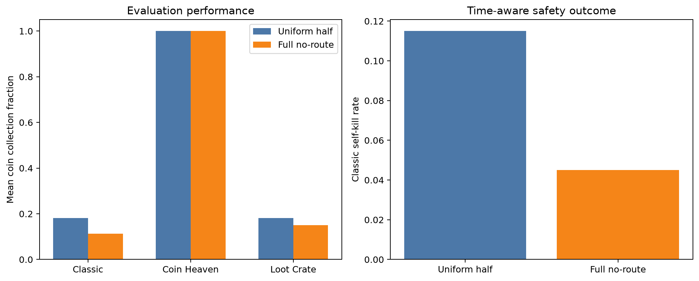
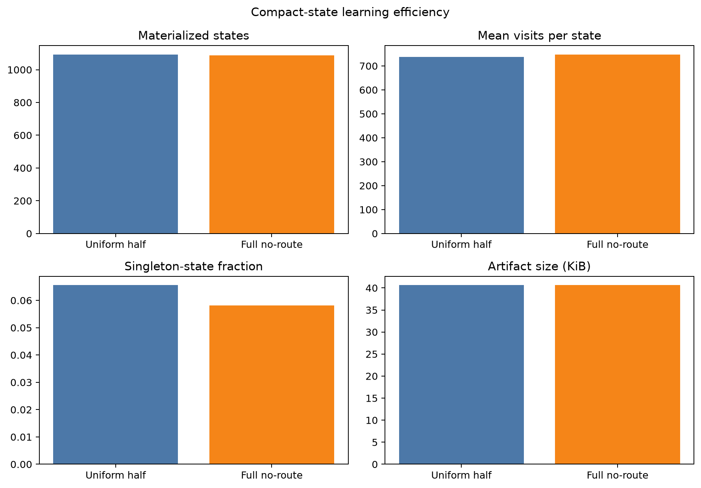

# Full no-route penalty with half-strength escape progress

> Status: completed; candidate rejected

## Metadata

- Issue: #142
- Agent: `DerKleineSprengstoffkapitalist`
- Owner: LiliWestermann
- Date: 2026-09-11
- Registration base: `08ca233`
- Implementation commit: `77819f57a4ee0d413cbce462187f7eb2e38632fa`
- Experiment commit: `d2e53c284d1363c324695287b72fb43080b38889`
- Approval: intermediate peer approval explicitly waived by the owner

## Research question and hypothesis

Does retaining the full `-5` potential only for states without a complete safe
route reduce Classic self-kills relative to uniform half strength without
losing more than `0.05` Classic collection?

Issue #139 showed that uniform half strength restored collection but failed its
safety guard. The hypothesis is that the no-route bucket, rather than ordinary
distance progress, carries the useful catastrophic-risk signal.

## Treatments

- Control: half-strength potentials `0, -0.5, -1, -1.5, -2.5`.
- Candidate: identical progress potentials, but `-5` for no complete route.

Both use `F(s,s') = 0.9 * Phi(s') - Phi(s)`. The no-route value is the only
treatment difference and changes learning rewards only.

## Controlled protocol

Both arms use compact state, zero-initialized one-step Q-learning, learning
rate `0.05`, discount factor `0.9`, epsilon `1.0 * 0.99` down to `0.1`, no
action mask, no useful-bomb bonus and final-checkpoint selection. Five paired
replicas each train for 2,000 Coin Heaven, 2,000 Loot Crate and 6,000 Classic
episodes. Each final model is evaluated on 40 fresh paired development seeds
per scenario and repeated deterministically.

## Decision rule

Accept the candidate only if all registered criteria pass:

- mean Classic self-kill rate is below control;
- its paired 95% bootstrap CI upper bound is below zero;
- at least four of five paired replicas have fewer Classic self-kills;
- Classic and Coin Heaven collection each decrease by no more than `0.05`;
- candidate/control mean visits per state is at least `0.90`;
- deterministic repeats match;
- decision-time p95 is below `50 ms` and maximum below `100 ms`.

## Execution

```bash
python -m training.run_plan \
  training/run_plans/issue142-compact-task2-uniform-half.yaml
python -m training.run_plan \
  training/run_plans/issue142-compact-task2-full-no-route.yaml
```

The owner explicitly authorized immediate execution without the intermediate
approval pause. This waiver does not alter treatments, seeds, budgets, metrics
or criteria.

## Results

Both plans completed all 1,215 jobs, for 100,000 training episodes and 2,400
evaluation episodes in total. The full no-route candidate reduced mean Classic
self-kill rate from `0.115` to `0.045` (candidate minus control `-0.070`), and
four of five paired replicas improved. The paired 95% bootstrap interval was
`[-0.165, 0.020]`, however, so the registered upper-bound gate did not pass.

Mean Classic collection decreased from `0.1811` to `0.1133`, a difference of
`-0.0678` with 95% interval `[-0.1595, 0.0161]`; this exceeded the allowed
`0.05` loss. Coin Heaven collection remained `1.000` in both arms. The
candidate/control mean-visits-per-state ratio was `1.0149`.

Five of nine criteria passed and four failed. The failed criteria were the strict self-kill confidence
interval, Classic collection retention, deterministic repeats and maximum
decision latency. One of 1,200 deterministic comparisons differed (control
`r4`, Loot Crate seed `154033`). Its repeat also contained a `1240.2 ms`
decision-time outlier, while all primary maxima were below `11 ms`; this single
event caused the registered `100 ms` maximum gate to fail. It is retained as
observed rather than rerun post hoc.

The complete seed-level inputs to these claims are in `evidence.csv`;
`training_diagnostics.csv`, `summary.csv` and `result.json` retain the derived
values. The decision can be reproduced without the raw run tree via:

```bash
python -m training.analyze_issue142_full_no_route --verify-from-evidence
```





## Interpretation and decision

The result supports the narrower mechanistic hypothesis descriptively: keeping
the stronger penalty only for no-route states coincided with substantially
fewer Classic self-kills than uniform half strength. The paired uncertainty is
still too wide to establish the registered confirmatory safety improvement,
and the treatment again sacrifices too much Classic collection. Therefore the
candidate is rejected as the default, and the current default remains
unchanged.

The isolated repeat mismatch and latency outlier also mean the complete
protocol did not reproduce deterministically under this execution. Because the
scientific decision already fails the safety-CI and collection gates, rerunning
that completed observation would not rescue the candidate and would violate
the prospective comparison. No confirmation seeds were used.

## AI assistance

OpenAI Codex assisted with implementation, tests, protocol registration,
execution, analysis, plotting and documentation. AI output is not experimental
evidence; all claims must be computed from retained outputs and reviewed by the
owner and a non-author reviewer.
