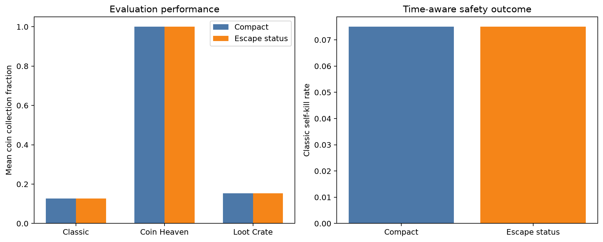
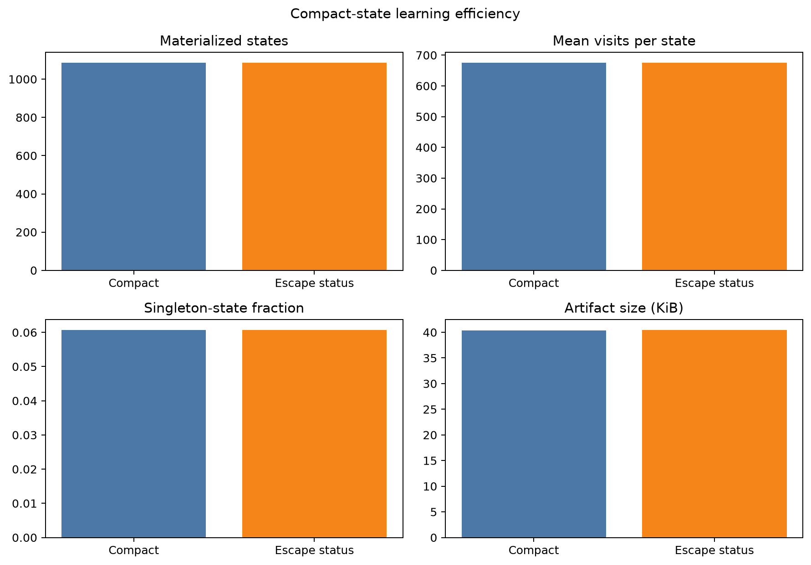

# Compact post-bomb escape-status experiment

> Status: completed; candidate rejected

## Metadata

- Issue: #144
- Agent: `DerKleineSprengstoffkapitalist`
- Owner: LiliWestermann
- Date: 2026-09-11
- Registration base: `08ca233`
- Implementation commit: `c849077e9a2782f284029edca1e3cd0705c202c1`
- Experiment commit: `e928dc31e50177fabedc5af49ef2ff7a43f6fb01`
- Approval: intermediate peer approval explicitly waived by the owner

## Research question and hypothesis

Does appending a categorical post-bomb escape status to the compact state
reduce Classic self-kills while retaining or improving hidden-coin collection?

The hypothesis is that distinguishing complete escape, temporary local safety
and no route resolves an information ambiguity that reward shaping could not
address without suppressing collection.

## Treatments

- Control: the existing five-value `compact_decision` representation.
- Candidate: the same five values plus `escape_after_bomb_status` with values
  `NOT_APPLICABLE`, `COMPLETE_ROUTE`, `TEMPORARY_SAFETY_ONLY`, and `NO_ROUTE`.

The additional value describes geometry only. It neither chooses nor masks an
action. Both arms use no potential shaping.

## Controlled protocol

Both arms use zero-initialized one-step tabular Q-learning, learning rate
`0.05`, discount factor `0.9`, epsilon `1.0 * 0.99` down to `0.1`, no action
mask, no potential shaping, no useful-bomb reward and final-checkpoint
selection. Five paired replicas train for 2,000 Coin Heaven, 2,000 Loot Crate
and 6,000 Classic episodes. Each final model is evaluated on 40 fresh paired
development seeds in all three scenarios and repeated deterministically.

## Decision rule

Accept the candidate only if all ten registered criteria pass:

- mean Classic collection is above control;
- the paired 95% bootstrap interval lower bound is above zero;
- at least four of five replicas improve Classic collection;
- candidate Classic self-kill rate is at most `0.055` and no higher than control;
- Coin Heaven collection decreases by no more than `0.05`;
- candidate/control mean visits per state is at least `0.90`;
- all deterministic repeats match;
- decision-time p95 is below `50 ms` and maximum below `100 ms`.

## Execution authorization

The owner explicitly instructed Codex to implement and execute the experiment
without the intermediate approval pause. This waiver is recorded before
training and does not alter the treatments, seeds, budget, metrics or criteria.

## Results

All 2,430 planned jobs completed: 1,215 per arm. The table reports means over
the five final models and 40 fresh evaluation seeds per scenario.

| Scenario | Collection control | Collection candidate | Self-kill control | Self-kill candidate |
| --- | ---: | ---: | ---: | ---: |
| Classic | 0.1272 | 0.1272 | 0.075 | 0.075 |
| Coin Heaven | 1.0000 | 1.0000 | 0.000 | 0.000 |
| Loot Crate | 0.1541 | 0.1541 | 0.225 | 0.225 |

The paired Classic collection difference was exactly `0.0000`, with a 95%
bootstrap interval of `[0.0000, 0.0000]`. Zero of five replicas improved.
The candidate also missed the absolute Classic self-kill limit of `0.055`.
Both treatments had the same mean visits per state (`675.516`, ratio `1.000`)
and evaluation unseen-state rate (`0.0096%`). Deterministic repeats matched,
and all registered latency limits passed. Overall, six of ten criteria passed.

The committed result can be reproduced from compact evidence with:

    python -m training.analyze_issue144_post_bomb_escape --verify-from-evidence

Figures:

## Interpretation and decision

Reject `compact_post_bomb_escape` and retain `compact_decision` as the default.
The candidate did not merely fail to improve the metrics: every retained
performance, safety and learning-efficiency outcome was identical to control.

A post-hoc inspection of the five candidate final Q-tables found status counts
of roughly 1,022--1,051 `NOT_APPLICABLE`, 47 `COMPLETE_ROUTE`, four
`TEMPORARY_SAFETY_ONLY`, and zero `NO_ROUTE` states per table. More importantly,
no shared five-value compact-state prefix occurred with multiple escape-status
values. Thus, on the visited data, the appended category acted only as a
one-to-one relabeling rather than resolving state aliasing. This diagnostic was
not a registered criterion and is used only to explain the exact null result.
Confirmation seeds were not used.

## AI assistance

OpenAI Codex assisted with implementation, tests, registration, execution,
analysis, plotting and documentation. AI output is not experimental evidence;
all reported values must be derived from retained framework outputs and
reviewed by the owner and a non-author reviewer.
