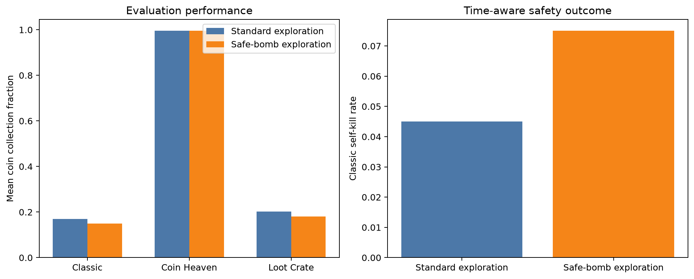
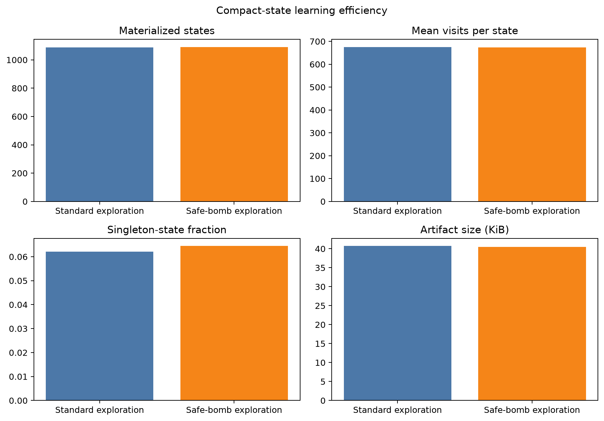

# Safety-constrained exploration for compact Task 2

> Status: completed; candidate rejected

## Metadata

- Issue: #153
- Agent: `DerKleineSprengstoffkapitalist`
- Owner: LiliWestermann
- Date: 2026-09-12
- Registration base: `08ca233`
- Implementation commit: `4b6b3cf7f22888dd10b19b3aca36da8990709123`
- Experiment commit: `7c4f11191d76efdb33f5e80a5e686dd4e7907544`
- Approval: intermediate peer approval explicitly waived by the owner

## Research question and hypothesis

Does excluding a clearly unsafe `BOMB` action only from random epsilon-greedy
exploration reduce final Classic self-kills without reducing collection?

The hypothesis is that fewer avoidable lethal exploration transitions improve
the learned policy. The treatment does not constrain greedy action selection,
Bellman targets, or evaluation.

## Treatments

- Control: `compact_decision` with standard epsilon-greedy exploration.
- Candidate: the same configuration, except `BOMB` is removed from the random
  exploration candidates when `bomb_status == UNSAFE`.

Both arms use no action masking and no potential shaping. The candidate does
not force an action or encode a rule-based escape policy.

## Controlled protocol

Both arms use zero-initialized one-step tabular Q-learning, learning rate
`0.05`, discount factor `0.9`, epsilon `1.0 * 0.99` down to `0.1`, unchanged
rewards, no action masking, no potential shaping, no useful-bomb reward, and
final-checkpoint selection. Five paired replicas train for 2,000 Coin Heaven,
2,000 Loot Crate, and 6,000 Classic episodes. Each final model is evaluated on
40 fresh paired development seeds in all three scenarios and repeated exactly.

## Decision rule

Accept the candidate only if all ten registered criteria pass:

- candidate Classic self-kill rate is at most `0.055` and below control;
- the paired 95% bootstrap interval upper bound for candidate minus control
  Classic self-kills is below zero;
- at least four of five replicas lower Classic self-kills;
- Classic collection decreases by no more than `0.01`;
- Coin Heaven collection decreases by no more than `0.05`;
- candidate/control mean visits per state is at least `0.90`;
- all deterministic repeats match;
- decision-time p95 is below `50 ms` and maximum below `100 ms`.

## Execution authorization

The owner explicitly instructed Codex to implement and execute this experiment
without the intermediate approval pause. This prospective waiver does not alter
the treatments, seeds, budget, metrics, or decision criteria.

## Results

All 2,430 planned jobs completed without retry: 1,215 per arm. Results are
means over five final models and 40 fresh primary seeds per scenario.

| Scenario | Collection control | Collection candidate | Self-kill control | Self-kill candidate |
| --- | ---: | ---: | ---: | ---: |
| Classic | 0.1694 | 0.1489 | 0.045 | 0.075 |
| Coin Heaven | 0.9953 | 0.9953 | 0.005 | 0.005 |
| Loot Crate | 0.2025 | 0.1810 | 0.240 | 0.160 |

The paired Classic self-kill difference (candidate minus control) was `+0.030`
with a 95% bootstrap interval of `[-0.015, +0.080]`. No replica improved:
four had a higher self-kill rate and one tied. Classic collection decreased by
`0.0206`, exceeding the registered `0.01` non-inferiority margin.

Mean visits per state were `675.726` for control and `673.755` for candidate
(ratio `0.997`). The evaluation unseen-state rates were `0.0107%` and `0.0035%`.
Coin Heaven retention and p95 latency passed. One control Loot Crate repeat
(`r2`, seed `174025`) recorded a `701.492 ms` decision and consequently a
different action sequence; therefore the maximum-latency and deterministic-
repeat criteria fail. No observed job was discarded or repeated after results
were known. Overall, three of ten criteria passed.

The committed result is reproduced from compact evidence with:

    python -m training.analyze_issue153_safe_bomb_exploration --verify-from-evidence

## Interpretation and decision

Reject `safe_bomb` exploration and retain standard epsilon-greedy exploration.
Restricting only random unsafe bomb choices did not transfer to a safer greedy
Classic policy. Instead, Classic self-kills increased and collection crossed
the registered degradation limit. The lower Loot Crate self-kill rate is a
secondary, scenario-specific observation accompanied by lower collection and
does not override the prospective decision rule.

The generic retained metrics include bomb totals and useful-bomb training
diagnostics, but do not distinguish unsafe placements made through exploration
from those made through exploitation. Consequently, the proposed unsafe-bomb
placement diagnostic is unavailable and no mechanism claim is made from it.
Confirmation seeds were not used.

## AI assistance

OpenAI Codex assisted with implementation, tests, registration, execution,
analysis, plotting, and documentation. AI output is not experimental evidence;
reported values must come from retained framework outputs and receive human
review before merge.
