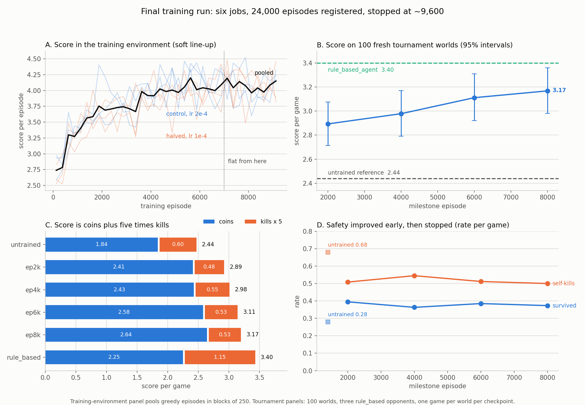
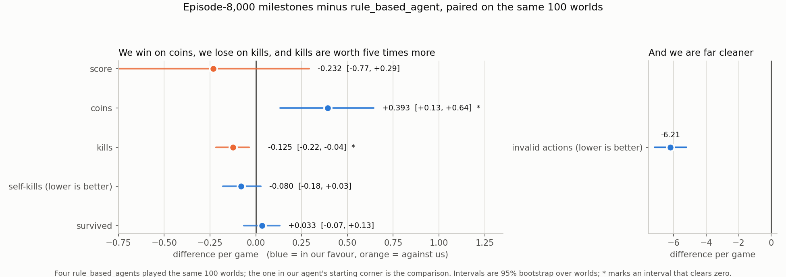

# Final tournament training run

This production run trained the agent we submit. We started it on 17 September at 01:04 and stopped it on 18 September at about 16:00, after roughly 9,600 of the registered 24,000 episodes per job. We stopped early to start a continuation from its own best checkpoint. Everything below comes from this run and what we learned from it.



## What we ran

|              |                                                                           |
| ------------ | ------------------------------------------------------------------------- |
| Registration | [config.json](config.json), profile `final-training`                      |
| Shape        | 2 arms x 3 replicas = 6 jobs, warm-started from the Task 3 incumbent      |
| Arms         | `control` at learning rate 2e-4, `halved` at 1e-4, the only factor varied |
| Budget       | 24,000 episodes per job registered, 12 milestones each                    |
| Line-up      | one `rule_based_agent`, one `coin_collector_agent`, one `peaceful_agent`  |
| Stopped at   | ~9,600 episodes per job, 57,000 episodes in total                         |

We bundled milestones from episodes 2,000 to 8,000. While training continued, we evaluated them on a second machine using 100 fresh worlds against three `rule_based_agent`s.

## Did it work? Yes.

Every earlier screen failed to beat the unchanged Task 3 incumbent. This run beat it, with a clear gain:

| milestone           | score | coins | kills | self-kills | survived |
| ------------------- | ----: | ----: | ----: | ---------: | -------: |
| untrained reference |  2.44 |  1.84 |  0.12 |       0.68 |     0.28 |
| episode 2,000       |  2.89 |  2.41 |  0.10 |       0.51 |     0.40 |
| episode 4,000       |  2.98 |  2.43 |  0.11 |       0.55 |     0.36 |
| episode 6,000       |  3.11 |  2.58 |  0.11 |       0.51 |     0.39 |
| episode 8,000       |  3.17 |  2.64 | 0.105 |       0.50 |     0.37 |

Pooled over all six replicas and paired per world, episode 8,000 improved score by +0.728 [+0.172, +1.265] over the untrained agent. Coins improved by +0.803 [+0.493, +1.117] and collection by +0.089 [+0.055, +0.124]. Episode 6,000 was the first milestone whose interval cleared zero.

The curve was steeper in the training environment because two of the three sparring partners are harmless. Score increased from 2.76 to about 4.04. Wasteful bombs fell from 7.75 to 2.13 per episode, while useful bombs increased from 11.5 to 17.6.

## Where the improvement came from, and where it stopped

Panel C of the figure shows the main result. Score in this framework is coins plus five times kills, and our numbers reproduce this exactly:

2.643 + 5 x 0.105 = 3.168.

* Coins improved and kept improving. They increased from 1.84 to 2.64 and were still rising at the last milestone.
* Self-kills improved once, early, and then stopped. They dropped from 0.68 to about 0.51 by episode 2,000 and stayed flat for the next 7,000 episodes.
* Kills never improved. They started at 0.12 and ended at 0.105, never exceeding the untrained agent.

The line-up trajectory screen had already shown this trade-off. As the agent learns to stop destroying itself, it also stops attacking, and the two effects cancel. This run reproduced the same result at ten times the budget.

The curve flattened at about episode 7,000. The last 2,000 greedy episodes gained +0.012 [-0.105, +0.111] score over the previous 2,000 episodes. The window before that gained +0.144 [+0.062, +0.220]. The interval was tight enough to detect a gain of the earlier size. We did not see one.

## How good is the result?



We evaluated four `rule_based_agent`s on the same 100 worlds and used the one starting in our agent's corner. This gives us a world-by-world paired comparison.

We are close to parity, with a score difference of -0.232 [-0.793, +0.282]. The decomposition shows where the gap comes from:

* coins +0.393 [+0.130, +0.645] in our favour
* kills -0.125 [-0.217, -0.038] against us
* invalid actions -6.21 in our favour, with `rule_based` at 7.74 per game and our agent at 1.53

One kill is worth five coins. The kill deficit therefore costs 0.63 score, while the coin surplus returns 0.39. This difference explains the full gap.

## What we did not fix, and why

Six registered experiments tried to make this agent hunt. All six failed to produce an improvement. We raised the elimination reward from +5 to +20 twice, removed the wasteful-bomb penalty for safe attacks over 50,000 episodes, tested approach shaping, and changed the training line-up twice.

The hunting diagnosis explains the mechanism. A bomb aimed at an opponent with no crate in its blast gives -0.5 immediately and with certainty. The +5 reward arrives four steps later, discounted to about two thirds, and only if the opponent fails to walk away.

We convert about one kill per hundred attack steps. The expected value of attacking therefore stays negative regardless of the kill reward.

## Two more important things about the evaluation

Choosing between our own checkpoints is not reliable at this sample size. We evaluated all 24 milestones on the same 100 worlds. The standard error of one checkpoint is 0.211 and the observed spread between checkpoints is 0.193, so the implied real difference is zero.

The rank correlation between the two halves of the worlds is -0.22. The top five checkpoints on one half share none with the top five on the other. The best-looking milestone is therefore not evidence of a better milestone. We select using a rule fixed in advance and spend no evaluation budget on checkpoint selection.

The registered promotion screen rejects every artifact. `legality_not_worse` requires every trained artifact to emit no more invalid actions than the untrained reference, with no tolerance. All 18 milestones fail this gate, ranging from 1.14x to 2.15x the reference. After normalising per 100 steps, 16 of 18 still fail.

We record this verdict instead of relaxing the gate. `rule_based` itself emits five times more invalid actions than our agent, so the gate measures exposure rather than legality.

## Why we stopped early

At episode 9,600, the curve had been flat for 2,500 episodes. We also found that meaningful selection between milestones was not supported by the evaluation data. The remaining 14,000 episodes per job would have kept the machine running until Saturday.

We stopped the run and started a continuation from its own episode-8,000 milestone, [2026-09-18-task4-warm-lineup](../2026-09-18-task4-warm-lineup/config.json). This continuation tests the remaining question from this run: whether training against three `rule_based_agent`s, the same line-up used for evaluation, closes the kill gap.

We keep every milestone from this run. If the continuation comes back flat, we submit the episode-8,000 checkpoint.

## Reproduction

Trajectory and comparison figures:

```text id="vy3jja"
python scripts/plot_final_training.py
```

Milestone evaluations are stored on `monitoring/final-training-evaluation` under `monitoring/final-training/cumulative/`, with one run record per evaluation in `monitoring/final-training/runs/`.

The 100 classic worlds are registered in [2026-09-17-final-training-monitoring](../2026-09-17-final-training-monitoring/config.json).
