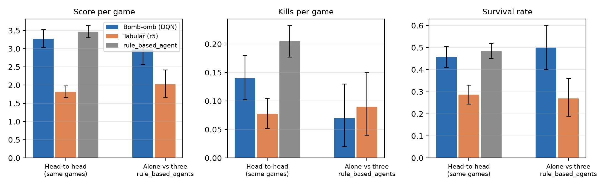

# Head-to-head benchmark: final tabular agent versus submitted Bomb-omb

## Metadata

- Issue: #234
- Agents: `Bomb-omb` (submitted DQN) and `DerKleineKonkurrenzvernichter` (frozen tabular agent)
- Date: 2026-09-27
- Config: [`config.json`](config.json)
- Runner: `scripts/run_final_agent_comparison.py`
- Analysis: `training/analyze_issue234_final_agent_comparison.py`

## Question

Our two agent lines had previously only been evaluated in separate experiments using different worlds. We therefore wanted to directly compare our two final agents on the same worlds and in the same games.

## Agents

We exported both agents unchanged from Git and verified their SHA-256 hashes before running any games. The verification is stored in `results/verified-artifacts.json`.

| Agent | Source | Artifact SHA-256 |
|---|---|---|
| `Bomb-omb` (submitted DQN, control-r1 after 8,000 episodes) | commit `6871896`, file-identical to the uploaded `Bomb-omb.zip` | `checkpoint.pt` `a5dadff5cc9f04a614caa828d3a0f014cad56f00c3644bb791275da85b35a8a6` |
| `DerKleineKonkurrenzvernichter` (Issue #228 replica r5, frozen in #230) | branch `freeze/230-final-tabular-agent` (`b4b53c7`) | `model.npz` `945b2cf0176b4ed57922aa6e12347f1ebbc19d675021dadb38eed6449075eb2d` |

Both agents run under tournament conditions with greedy policies, default agent seeds, no `BOMBERMAN_*` environment overrides, and one thread each. Framework files remain unchanged from `main`.

## Protocol

We fixed the protocol in Issue #234 before running the first game.

We used the Classic scenario with world seeds 234001 to 234100. None of these 100 worlds had been used in our earlier experiments.

The head-to-head suite placed `Bomb-omb`, `DerKleineKonkurrenzvernichter`, and two `rule_based_agent`s in the same games. We played every world with all four seat rotations, resulting in 400 games.

The second suite evaluated each learned agent separately against three `rule_based_agent`s on the same 100 worlds. For both agents, the learned agent occupied seat `world index mod 4`. This resulted in another 200 games.

Our primary endpoint was the mean per-game score difference between Bomb-omb and the tabular agent in the head-to-head suite. We used the world as the experimental unit by averaging its four seat rotations. The 95% percentile bootstrap interval uses 10,000 resamples with seed 234.

The registered success criterion required the lower bound of this interval to be above zero.

As secondary descriptive metrics, we recorded coins, kills, self-kills, survival, strict first-place rate, invalid actions, and decision time. We also calculated paired per-world differences in the separate rule-based suite and compared each learned agent's score with the mean score of its three `rule_based_agent` opponents in the same game.

## Results

All 600 games completed successfully. Both agent artifacts matched their registered SHA-256 hashes before the first game.

### Head-to-head suite

The head-to-head suite contains 400 games with both learned agents competing in the same game.

| Per game | Bomb-omb | Tabular (r5) | Difference [95% interval] |
|---|---:|---:|---:|
| Score | 3.28 | 1.82 | +1.46 [+1.16, +1.77] |
| Coins | 2.58 | 1.43 | +1.15 [+0.98, +1.32] |
| Kills | 0.140 | 0.077 | +0.062 [+0.015, +0.113] |
| Self-kills | 0.49 | 0.43 | +0.06 [−0.01, +0.13] |
| Survival | 46% | 29% | +17 points [+11, +23] |
| Strict first place | 25% | 7% | +18 points [+12, +23] |
| Invalid actions | 1.70 | 7.47 | −5.77 [−6.44, −5.15] |
| Mean placement (1 = best) | 2.09 | 2.91 | −0.82 [−0.95, −0.68] |

The two `rule_based_agent`s in these games averaged 3.47 points, 0.205 kills, and 49% survival.

The primary score difference was +1.46 points per game with a 95% interval of [+1.16, +1.77]. The lower bound is above zero, so the registered success criterion is met.

### Versus rule-based suite

We also evaluated each learned agent separately against three `rule_based_agent`s on the same 100 worlds.

| Per game | Bomb-omb | Tabular (r5) | Difference [95% interval] |
|---|---:|---:|---:|
| Score | 2.98 | 2.03 | +0.95 [+0.42, +1.49] |
| Coins | 2.63 | 1.58 | +1.05 [+0.75, +1.36] |
| Kills | 0.07 | 0.09 | −0.02 [−0.10, +0.06] |
| Self-kills | 0.41 | 0.46 | −0.05 [−0.19, +0.09] |
| Survival | 50% | 27% | +23 points [+10, +36] |
| Strict first place | 24% | 8% | +16 points [+7, +25] |
| Invalid actions | 1.61 | 9.32 | −7.71 [−9.18, −6.36] |

Compared with the mean score of the three `rule_based_agent` opponents in the same games, Bomb-omb achieved a difference of +0.09 [−0.45, +0.65]. The tabular agent achieved −1.40 [−1.92, −0.87].

Decision times remained well below the 500 ms tournament limit. Bomb-omb had a median per-game p95 of 8.6 ms and an overall maximum of 44.1 ms. The tabular agent had 0.9 ms and 35.0 ms respectively.



## Interpretation

Bomb-omb performed better than the tabular agent in both evaluation suites.

In the direct head-to-head games, Bomb-omb scored 1.46 points more per game, collected 1.15 more coins, survived 17 percentage points more often, and achieved a strict first place in 25% rather than 7% of games. It also produced substantially fewer invalid actions.

Bomb-omb also recorded slightly more kills in the head-to-head comparison, with a difference of +0.062 kills per game. In the separate evaluation against three `rule_based_agent`s, this kill difference disappeared. Bomb-omb reached 0.07 kills per game compared with 0.09 for the tabular agent, with an interval that included differences in both directions.

The main advantage of Bomb-omb therefore came from stronger coin collection, higher survival, and fewer invalid actions rather than from a consistently higher elimination rate.

Bomb-omb also performed close to the `rule_based_agent` opponents in the separate suite. Its score difference to their mean was +0.09 with an interval containing zero. The tabular agent remained clearly below the same opponents with a score difference of −1.40.

These results support our final decision to submit Bomb-omb over the tabular agent. The benchmark does not establish that DQN is generally better than tabular Q-learning. It compares one frozen final checkpoint from each development line.

## Limitations

`rule_based_agent` uses unseeded randomness, so repeated games are not bit-identical. Using the same worlds and rotating seats reduces this source of variation but does not remove it completely.

Each learning approach is represented by one frozen checkpoint. The benchmark therefore compares these two final artifacts rather than the underlying learning methods in general.

We also ran this benchmark after the submission deadline. It therefore did not influence the original submission decision and serves as a retrospective comparison of the two final agent lines.

## Reproduction

```bash
python scripts/run_final_agent_comparison.py
python -m training.analyze_issue234_final_agent_comparison
python -m pytest tests/test_analyze_issue234_final_agent_comparison.py
```

The runner resumes from already completed games when results are available.